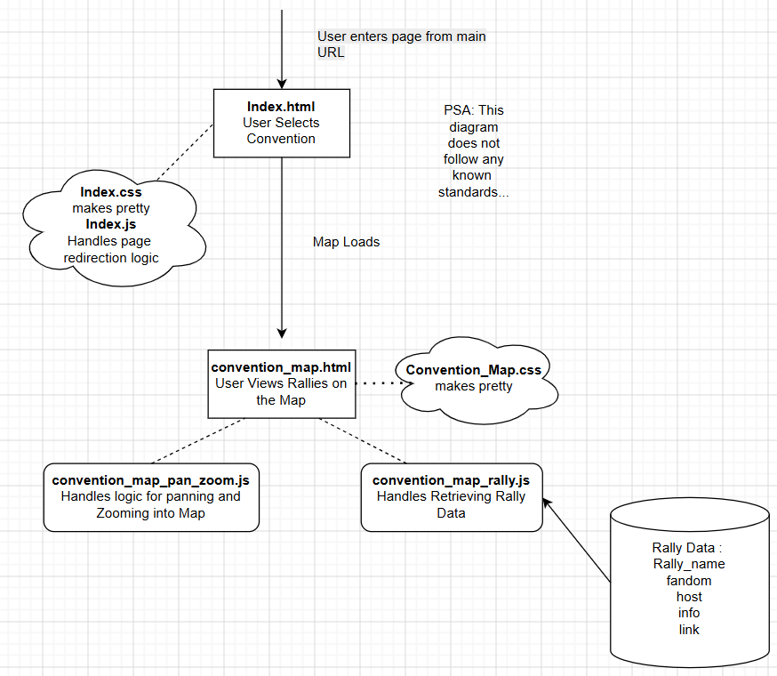

# Artist_Rally
A stamp rally map for Artist Alleys

# Tech Stack
Basic HTML, CSS, JS

# How to Run
1. Pull Repo from Github
2. In VSCode download Live Server Extension (By Ritwick Dey)
3. Right Click index.html file and select "Open with Live Server"

# Vision
- Users by default are on a guest account, no sign in required
- Users only sign in if they want to favourite and mark off Stamp rallies
- Users only need a username and 4 digit pin to create an acc to sign in. This 
account is temporary and deleted once a convention is over 

- Users can create stamp rallies. The user who creates it becomes the Host of the rally
- Hosts have the power to add and remove artists from an alley, as well as write and edit rally descriptions 
- Hosts can Share a link or a Code with fellow artists to add them in (Max 30 artist limit per stamp rally)
- Hosts can also generate a seperate sharing link to provide to stamp rally participants. 
    Note:(This link should never change once generated, in case the Host has already created physical cards)

- Once an artist is invited to a rally - they can put a marker on the map indicating their stall Number. They can also enter in information such as their socials or catalogue or just a general greeting. 
- Each artist must create a account so that they can edit anything in case of change
- This marker then becomes visible to those interested in the stamp rally

# Update Log
#### Update: 27/06/26 11:30PM 
    - repo split into frontend and backend folders
    - added server.js to handle server requests
    - added initialise_database.js to populate MySQL database with dummy data
    - local MySQL database up and running (backend contributors will have to download mysql onto their device and edit             enironment variables)
    - The convention list no longer contain static data after being connected to database (however still redirect to same          page which will have to be changed)

#### Update: 21/06/26 11:26PM 
    - users now have to sign in to favorite (see example sign ins in data/account.json if you want test data)
    - Favourites and accounts are currently static data (so any changes or new data will not be shown)
    - my next goal is to be able to store real data

# File explaination
### Frontend
1. index.html => the first page which lets you select which convention you are attending
    - index.js so far is only used for redirection to convention_map.html
    - index.css is the styling for index.html to make it look ✨ prettier ✨
2. convention_map.html => the convention map and rally viewer
    - convention_map.css is the styling for index.html 
    - convention_map_pan_zoom.js is a script used by convention_map.html to control map panning 
    and zooming 
        - currently only zooming works but not panning. This needs to be fixed
        - (code taken from nurbs 3000 https://github.com/nurbs3000/may2025/blob/main/panZoomImage.html)
    - convention-map-rally.js is another script used by convention_map.html used to display individual rally associated data.
    - convention-sign-in.js is another script used by convention_map.html used for sign-in behavior
3. Other folders
    - Data Folder : Contains Dummy Data for Testing
    - Icons : Contains Images used for icons in the app
    - Map : Contains Maps for each convention
    - Refs : Contains Code that was used as reference during development (makes it easier to refer back on)
  
### Backend
1. server.js => the code for the api the frontend calls to update and grab data (GET, POST, PUT, DELETE) from the database
    - contributors will need to update .env with their mysql credentials to test with the database
    - server can be started using `npm start`
3. initialise_database.js => running this file will create a mock database (if the database already exists it will delete it     and reinitialise with a new db) with prepopulated data
   - mysql installation prerequisite
   - contributors will need to update .env with their mysql credentials to test with the database

# TODOs
- Currently all roads lead to smash from the initial index page
- Make Pan in Map zoom and Pan work
- Make things pretty
<s>- Add accounts</s>
<s>- Add favourites</s>
- Add Markers 
- Add Rally Invites
- Add Rally info Popups
- Add Stall popups
- Add special Artist accounts
- Make a in-progress/visited marker for rallies
- Create Unique Links for rally invites/Setup

# Other notes:
- I Opted for a Web App since writing code for both ios and android seems painful and I don't wanna pay app store fees or force people to download an app to view stamp rallies
- Working on mobile version first
- icons i am using can be found at https://www.streamlinehq.com/icons/plump-remix-style?search=heart
